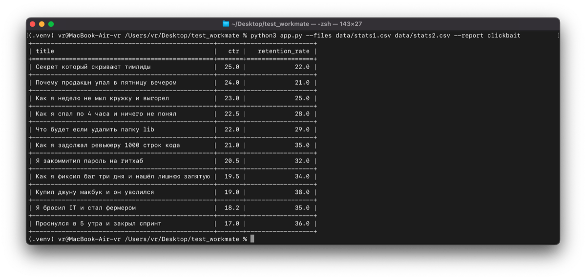
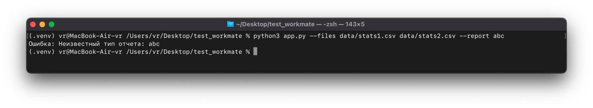

# YouTube Video Metrics Reporter

CLI-приложение читает CSV с метриками YouTube-видео и выводит в консоль отчёт (например, список «кликбейтных» роликов с высоким CTR и низким удержанием).

## Требования

- Python **3.10+**
- [uv](https://docs.astral.sh/uv/) для управления зависимостями

## Установка

1. Установите `uv` (если ещё не установлен):

```bash
curl -LsSf https://astral.sh/uv/install.sh | sh
```

2. Клонируйте репозиторий и перейдите в каталог проекта:

```bash
cd test_workmate
```

3. Создайте виртуальное окружение и установите зависимости:

```bash
uv sync
```

`uv sync` автоматически создаст `.venv`, поставит runtime-зависимости из `pyproject.toml` и dev-зависимости (`pytest`, `pytest-cov`, `ruff`).

## Как пользоваться

Запускайте через `uv run` из корня репозитория.

### Аргументы

| Параметр | Описание |
|----------|----------|
| `--files` | Один или несколько путей к CSV-файлам (обязательно) |
| `--report` | Тип отчёта. Сейчас доступен: `clickbait` (обязательно) |
| `--log-level` | Уровень логирования: `DEBUG`, `INFO`, `WARNING` (по умолчанию), `ERROR` |

Отчёт **только печатается в терминал** (таблица). Технические сообщения (warnings, errors) идут через `logging` в stderr.

### Пример

Один файл:

```bash
uv run python app.py --files data/stats1.csv --report clickbait
```

Несколько файлов (данные объединяются):

```bash
uv run python app.py --files data/stats1.csv data/stats2.csv --report clickbait
```

С подробным логированием:

```bash
uv run python app.py --files data/stats1.csv --report clickbait --log-level DEBUG
```

### Ошибки

- Указан несуществующий файл — программа завершится с записью в лог и кодом возврата `1`.
- Неизвестное значение `--report` — сообщение о неизвестном типе отчёта.

## Тесты

```bash
uv run pytest --cov=src
```

## Линтер и форматтер

В проекте настроен [ruff](https://docs.astral.sh/ruff/) (линтер + форматтер).

```bash
uv run ruff check .       # линт
uv run ruff format .      # автоформат
uv run ruff format --check .  # проверить формат без изменений
```

Конфигурация — в `pyproject.toml` (секции `[tool.ruff]` и `[tool.ruff.lint]`).

## Структура

- `app.py` — точка входа CLI.
- `src/loader.py` — загрузка CSV в `list[VideoRecord]` (TypedDict). Невалидные строки логируются и пропускаются.
- `src/reports.py` — отчёты: `Report` (Protocol), `ClickbaitReport`, `ReportRegistry`. DTO результата — `ClickbaitRow` (`@dataclass(frozen=True, slots=True)`).
- `tests/` — тесты, использующие `@pytest.fixture` и `@pytest.mark.parametrize`.

---

##  Пример работы программы

Корректный запуск программы



Запуск с неизвестным типом отчета


